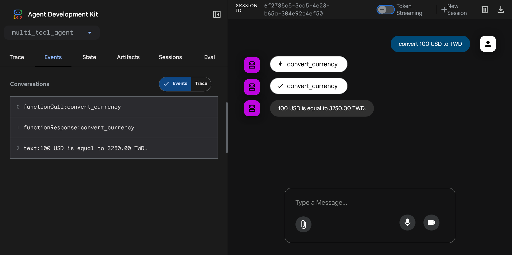

# google-adk-with-litellm

This repository demonstrates how to build AI agents using Google ADK, while integrating Azure OpenAI models via LiteLLM.

## Overview

- **Google ADK**: An open-source toolkit for developing intelligent agents in Python.
- **LiteLLM**: A lightweight library that simplifies access to various LLM providers, including Azure OpenAI.
- **Azure OpenAI**: Cloud-based large language models from Microsoft Azure.

## Getting Started

### 1. Environment Setup

Create a Python virtual environment and install dependencies.
**Recommended Python version: 3.12**

```bash
python -m venv .venv
source .venv/bin/activate
python -m pip install -r requirements.txt
```

### 2. Configuration

Copy the provided `multi_tool_agent/.env_example` file to `multi_tool_agent/.env`, then fill in your Azure OpenAI credentials:

```bash
cp multi_tool_agent/.env_example multi_tool_agent/.env
```

### 3. Example Agent

The sample agent supports currency conversion, joke telling, and multiplication. You can extend its capabilities by adding more tools.

#### Key Components

- **Currency Conversion Tool**: Converts between USD and TWD using mock rates.
- **Joke Tool**: Returns a random joke.
- **Math Tool**: Multiplies two numbers.

#### Agent Initialization

The agent is created using `Agent` from Google ADK, with LiteLLM configured to use Azure's GPT models.

### 4. Running the Demo

Start the development UI by running:

```bash
adk web
```

Once the server starts, you should see output similar to:

```text
INFO:     Started server process [79803]
INFO:     Waiting for application startup.

+-----------------------------------------------------------------------------+
| ADK Web Server started                                                      |
|                                                                             |
| For local testing, access at http://localhost:8000.                         |
+-----------------------------------------------------------------------------+

INFO:     Application startup complete.
INFO:     Uvicorn running on http://127.0.0.1:8000 (Press CTRL+C to quit)
```

Open your browser and go to [http://localhost:8000](http://localhost:8000).

Below is an example of an ADK conversation.
This screenshot demonstrates how the agent responds to user queries using its integrated tools.



## Development

For code quality and consistency, this project uses **pre-commit**.
Make sure you have the development dependencies installed:

```bash
python -m pip install -r requirements-dev.txt
pre-commit install
pre-commit install -t commit-msg
```
